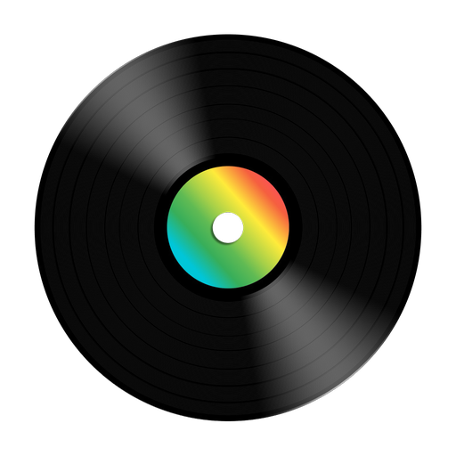

# Lingo Jam  

Do you like music? Do you also like learning languages? With Lingo Jam, you can learn a new language while listening to great music!

Listen to radio streams from all over the world in the world's most popular languages! That way you can practice and enjoy some sweet grooves. :notes:

Features:

- Listen to radio stations from all over the world
- Save stations you like in your favourites list so you can listen to them again
- Remove stations that don't work so you won't see them again

Supported Languages (more to come!)

 

- Chinese - 中文 (Zhōngwén), 汉语, 漢語
- English
- Spanish - Español
- Arabic - العربية
- German - Deutsch
- Hindi - हिन्दी, हिंदी
- Bengali - বাংলা
- Indonesian - Bahasa Indonesia
- French - français
- Russian - русский
- Portuguese - Português
- Japanese - 日本語 (にほんご)
- Italian - Italiano
- Greek - Ελληνικά
- Korean - 한국어
- Swahili - Kiswahili

Original README content

 

Notes to the adjudicators:

- I don't have an Apple developer account, so this app was not tested on iOS. If you're planning on using an iPhone, please keep this in mind.
- The debug build has a testing page that can be reached via the last navigation item in the bottom bar.

# B-Radio CL

The starting code for the B-Synergy Flutter contest 2022 The contest is adjudicated by the judges and is based who presented the best app, based on the following broad criteria:

* Functionality - what new functionality did you add to make the app more like a proper radio app. Some ideas:
  * Cleaning up the data - removing duplicates etc.
  * Looking at stations beyond the Netherlands.
  * Dig around the api - what else could be interesting to use?
  * Filtering on users favorite tags.
  * User's list of favourite stations.
  * Persist app data (hint: use hive).
* UI - what improvements did you add to the UI make it look better.
* Architecture - to what extent did your new code stick to the principle of seperation of concerns.
* Code quality - is the code you added clear, readable while concise and 'Flutter like'.

## Contest Rules

* The judges are Paul Schunk & Chris Laurie. They may ask additional people to assist, at their own discretion.
* The prize money is €500. How this is finally awarded is at the sole discretion of the judges.
* All code must be written by the entrant - pairing allowed. Some code snippets may be copied from the internet.
* Closing date of the contest is 28 February 2021
* Entries will be reviewed by the judges and a winner announced as soon after closing as possible, hopefully by the last bbq in March.
* Entries are to be submitted in the form of a Github code repository link. This should be different to this repository and master branch.
* Rules will be amended as needed.

